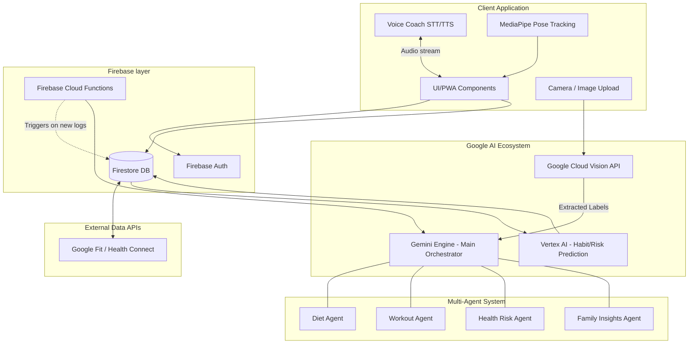

# AI-Powered Health & Fitness Companion

This document outlines the architecture, tech stack, and step-by-step build plan for a production-grade, AI-powered health and fitness application. The system leverages the Google AI ecosystem (Gemini, Vision API, MediaPipe, Speech-to-Text, Vertex AI) to provide real-time, adaptive coaching for diet, posture, and overall wellness across diverse user profiles and "Family Mode" configurations.

## User Review Required

> [!IMPORTANT]  
> Please review the following architectural decisions before we begin implementation:
> 1. **Platform Choice:** The plan assumes a **Next.js (Web/PWA)** approach for the initial MVP as it allows rapid integration with MediaPipe (via browser) and Next.js API routes for seamless Gemini integration. Would you prefer this, or native **Flutter**?
> 2. **Authentication:** We will use Firebase Auth. Do you want to enforce Google Sign-in as the primary method?
> 3. **Indian Food Database:** While Cloud Vision handles image recognition, accurate calorie mapping requires a nutrition database (e.g., FatSecret API, Nutritionix, or a custom mapping in Firestore). We will start with Gemini's built-in knowledge supplemented by Cloud Vision labels. Is this acceptable for the MVP?

## 1. Full System Architecture Diagram



## 2. Tech Stack Breakdown

- **Frontend Application:** Next.js (React), TailwindCSS (or pure CSS as requested), Framer Motion for micro-animations.
- **Computer Vision (Posture):** `@mediapipe/pose` running client-side for low latency.
- **Computer Vision (Food):** Google Cloud Vision API for multi-label detection of Indian food.
- **Voice Interactions:** Google Cloud Speech-to-Text (STT) and Text-to-Speech (TTS) / Gemini Live capabilities.
- **Core Orchestrator / Agents:** Google Gemini Pro/Flash APIs configured with custom system instructions for distinct agent personas.
- **Database & Backend:** Firebase Firestore (NoSQL), Firebase Cloud Functions (Node.js) for inactivity triggers.
- **Advanced Machine Learning:** Google Cloud Vertex AI (AutoML Tabular or custom models for risk scoring and habit prediction).
- **Wearable Data:** Google Fit API / Health Connect integrations.

## 3. API Integration Structure

1. **Food Scan Flow:**
   - Client sends base64 image or Cloud Storage URL to `api/scan-food`.
   - Next.js backend calls `Vision API` -> extracts labels (e.g., "Dosa", "Coconut Chutney").
   - Backend queries Gemini with the labels to extract nutrition info (sugar, calories, protein) specific to Indian cuisine.
   - Saves to Firestore `meals` collection.
2. **Workout Flow:**
   - Client runs MediaPipe locally via webcam.
   - Client computes joint angles (e.g., knee depth during squats).
   - If bad posture detected > 3 times, triggers Voice Agent API.
   - Voice Agent API (STT -> Gemini -> TTS) provides real-time coaching audio.
3. **Inactivity Flow:**
   - Firebase Function scheduled cron job checks `users/{uid}/daily_logs`.
   - If inactivity > threshold, Function invokes Gemini to generate a personalized smart notification based on their specific mode (e.g., Elderly vs. General Fitness) and pushes via FCM.

## 4. Example Gemini Prompt Templates

### Diet Agent Prompt
```text
You are an expert AI Dietician specializing in Indian cuisine and metabolic health.
User Profile: {age} years old, {weight}kg, Goal: {goal}, Mode: {health_mode}.
Context: The user scanned a meal detected as: {vision_api_labels}.
Task: 
1. Estimate calories, sugar, protein, and fat quality.
2. Analyze the health impact based on their {health_mode} (e.g., if Diabetes Mode, focus on Glycemic Load).
3. Suggest portion control and healthier alternatives if necessary.
Format your response as structured JSON.
```

### Workout/Posture Agent Prompt
```text
You are an empathetic, motivating AI Personal Trainer.
Context: The user is attempting {exercise_name}. MediaPipe telemetry indicates: {posture_error_logs} (e.g., "knees caving in").
Voice Input from User: "{user_spoken_query}"
Task: Give a short, punchy, conversational verbal correction and answer their query. Keep it under 2 sentences to be converted via TTS. Adapt your tone: if the user is in 'Elderly Mode', be extremely gentle and cautious.
```

## 5. Database Schema (Firebase Firestore)

```json
{
  "users": {
    "user_id_1": {
      "name": "Arjun",
      "age": 35,
      "health_mode": "Diabetes",
      "familyGroupId": "family_group_1",
      "preferences": { ... },
      "metrics": { "weight": 75, "cholesterol": "high" }
    }
  },
  "family_groups": {
    "family_group_1": {
      "members": ["user_id_1", "user_id_2"],
      "shared_insights": { "weekly_winner": "user_id_2" }
    }
  },
  "meals": {
    "meal_id_1": {
      "userId": "user_id_1",
      "timestamp": "2026-04-07T08:30:00Z",
      "visionLabels": ["Idli", "Sambhar"],
      "estimatedNutrition": { "calories": 350, "glycemicLoad": "medium" },
      "aiFeedback": "Watch out for the rice batter portions to manage sugar spikes."
    }
  },
  "workouts": {
    "workout_id_1": {
      "userId": "user_id_1",
      "type": "Yoga",
      "duration": 45,
      "postureCorrections": 3,
      "timestamp": "..."
    }
  }
}
```

## 6. Key Code Snippets

### A. MediaPipe Pose Integration (Frontend React Snippet)
```javascript
import { Pose, POSE_CONNECTIONS } from '@mediapipe/pose';
import * as cam from '@mediapipe/camera_utils';

const initializePoseTracker = (videoRef, canvasRef) => {
  const pose = new Pose({
    locateFile: (file) => `https://cdn.jsdelivr.net/npm/@mediapipe/pose/${file}`,
  });
  
  pose.setOptions({ modelComplexity: 1, smoothLandmarks: true, minDetectionConfidence: 0.5 });
  
  pose.onResults((results) => {
    // 1. Draw results on canvas
    drawConnectors(canvasRef.current, results.poseLandmarks, POSE_CONNECTIONS);
    
    // 2. Logic Layer: Calculate angles (e.g., Knee angle for squats)
    if (results.poseLandmarks) {
      const hip = results.poseLandmarks[23];
      const knee = results.poseLandmarks[25];
      const ankle = results.poseLandmarks[27];
      const angle = calculateAngle(hip, knee, ankle);
      
      if (angle < 90 && isIncorrectPosture) {
          triggerCorrectionAlert("Keep your knees behind your toes!");
      }
    }
  });

  const camera = new cam.Camera(videoRef.current, {
    onFrame: async () => { await pose.send({ image: videoRef.current }); },
    width: 640, height: 480
  });
  camera.start();
};
```

### B. Firebase Function Trigger for Gemini Insights (Backend Snippet)
```javascript
const functions = require('firebase-functions');
const admin = require('firebase-admin');
const { GoogleGenerativeAI } = require('@google/generative-ai');

admin.initializeApp();
const genAI = new GoogleGenerativeAI(process.env.GEMINI_API_KEY);

exports.onMealLogged = functions.firestore
  .document('meals/{mealId}')
  .onCreate(async (snap, context) => {
    const meal = snap.data();
    const user = await admin.firestore().collection('users').doc(meal.userId).get();
    
    const prompt = `User in ${user.data().health_mode} Mode ate ${meal.visionLabels.join(', ')}. Assess health risk.`;
    const model = genAI.getGenerativeModel({ model: "gemini-pro" });
    const result = await model.generateContent(prompt);
    
    return snap.ref.update({ aiFeedback: result.response.text() });
  });
```

## 7. Step-by-Step Build Plan

- **Phase 1: Foundation & UI (Days 1-2)**
  - Initialize project (Next.js or chosen framework).
  - Setup core modern, premium aesthetically dark-mode UI with Framer motion.
  - Setup Firebase (Auth, Firestore, Cloud Functions).
- **Phase 2: The Core AI Engine & Agents (Days 3-4)**
  - Integrate Gemini API.
  - Build the prompt management system for the Diet, Workout, Health Risk, and Family Agents.
  - Implement User Profile creation and "Health Mode" selection logic.
- **Phase 3: The Food Scanner System (Days 5-6)**
  - Implement image upload/camera capture.
  - Integrate Google Cloud Vision edge-functions.
  - Pipe Vision results into the Diet Agent for context-aware Indian food breakdown.
- **Phase 4: Posture Tracking MVP (Days 7-8)**
  - Integrate MediaPipe React components.
  - Write logic layer to calculate 1 or 2 specific exercises (e.g., Squats) for joint angles.
- **Phase 5: Voice & Notifications (Days 9-10)**
  - Hook up Web Speech API / Google STT & TTS.
  - Connect voice inputs to Gemini for conversational Q&A.
  - Write Firebase cron jobs for inactivity.
- **Phase 6: Polish & Family Mode (Days 11-12)**
  - Finalize Family Mode shared dashboard.
  - Refine UI to guarantee the "WOW" factor (vibrant accents, glassmorphism, responsive).
  - End-to-end testing of the flows.

## Open Questions
- Do we have specific Google Cloud billing accounts setup for Vision/Vertex AI/Gemini, or should I structure everything to run in local API simulation for the MVP until keys are provided?

## Verification Plan
1. **Automated Validation:** Test Next.js API routes with mock Vision and Gemini payloads. Verify Firebase triggers execute on mock document creation.
2. **Manual Verification:**
   - Upload images of Indian food to verify the Vision -> Gemini flow accurately responds with customized Diet Agent feedback.
   - Test "Diabetes Mode" vs "General Mode" to ensure tone/advice shifts correctly.
   - Actify webcam flow to test MediaPipe frame-rate and basic joint angle console logs.
